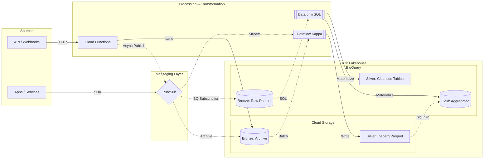

# cloud-landerox-data

[](https://github.com/landerox/cloud-landerox-data/actions/workflows/lint.yml)  [](https://cloud.google.com/)

> **Serverless Lakehouse: Unified Kappa & Medallion Pipelines**

## What this repository is

This repository contains the **application/processing logic** for a data platform on GCP:

- **Event-driven ingestion** with **Cloud Functions** and **Pub/Sub**
- **Processing** (stream + batch) with **Dataflow (Apache Beam)**
- Storage across **Bronze/Silver/Gold** layers using **GCS + BigQuery**, aligned with Lakehouse/BigLake principles

## Architecture

This diagram provides a simplified view. For detailed guides on architecture, CI/CD, and engineering practices, see [Documentation](#documentation).



## Key Features

- **BigLake Lakehouse:** Queries GCS data directly from BigQuery using Apache Iceberg for ACID transactions and Standard Parquet/Avro for high-throughput append-only workloads.
- **Multi-Format Ingestion:** Supports Parquet, Avro, and JSON in the Bronze layer to optimize for different source characteristics.
- **AI/ML Interoperability:** Open formats (Parquet) on GCS make data natively accessible to Vertex AI and Dataproc.
- **Unified Kappa Architecture:** Single Dataflow codebase for both real-time streaming and historical batch processing.
- **Serverless Scaling:** Fully managed ingestion and processing using Cloud Functions, Pub/Sub, and Dataflow.

## Data Layers

| Layer | Storage | Technology | Purpose |
| :--- | :--- | :--- | :--- |
| **Bronze** | GCS | JSON, Avro, Parquet | Long-term immutable archive |
| **Bronze** | BigQuery | Raw tables | Immediate SQL access |
| **Silver** | GCS (Lakehouse) | Iceberg, Parquet/Avro via BigLake | Cleansed & enriched |
| **Silver** | BigQuery | Native tables | High-performance internal use |
| **Gold** | BigQuery | Materialized Views | Business-level aggregations (Dataform) |

## Ingestion & Transformation Patterns

| Pattern | Flow | Use Case | Tooling |
| :--- | :--- | :--- | :--- |
| **ETL (Heavy)** | PS/GCS → Dataflow → SilverLake | Complex streaming, deduplication, enrichment | Dataflow |
| **ELT (Light)** | BQ/BigLake → Dataform → Gold | SQL-centric business logic, rapid materialization | Dataform |
| **Decoupled API** | API → CF → Pub/Sub | High-concurrency webhooks, resilient ingestion | CF + Pub/Sub |
| **Direct Archive** | API → CF → GCS | Low-cost, immutable archival of raw payloads | CF + GCS |

## Repository Structure

| Directory | Description |
| :--- | :--- |
| `functions/` | Cloud Functions for event-driven ingestion |
| `dataflow/pipelines/` | Unified Beam pipelines (Silver layer) |
| `shared/common/` | Shared utilities (Logging, Secrets, I/O) |
| `*/examples/` | Reference templates and best-practice samples |
| `.github/workflows/` | CI/CD pipelines for code quality |

## Getting Started

### Prerequisites

- Python 3.12+
- [`uv`](https://docs.astral.sh/uv/) — fast Python package installer and resolver
- [`just`](https://github.com/casey/just#installation) — command runner

Alternatively, use the provided **Dev Containers** (requires Docker and a compatible IDE like VS Code).

### Setup

```bash
# Install dependencies and create virtual environment
just sync

# Install pre-commit hooks (recommended)
just pre-commit-install
```

### Quality Checks

```bash
# Linting & formatting
just lint
# just format --fix    # auto-fix formatting issues

# Static type analysis
just type

# Unit tests
just test
```

## Documentation

- **[Architecture Guide](docs/architecture.md)** — Design decisions and interoperability
- **[CI/CD Guide](docs/cicd.md)** — Automated workflows and deployment standards
- **[Dataflow Engineering Guide](docs/guides/dataflow.md)** — Apache Beam best practices
- **[Cloud Functions Engineering Guide](docs/guides/functions.md)** — Serverless ingestion best practices

## License

MIT License. See [LICENSE](LICENSE) for details.
