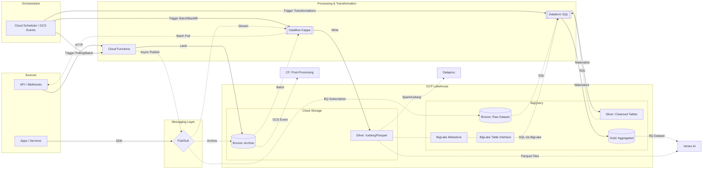

# System Architecture

## Overview

This repository implements a **Serverless Lakehouse** using the **Medallion Architecture** (Bronze, Silver, Gold). It leverages **BigLake** to bridge the gap between Data Lakes (GCS) and Data Warehouses (BigQuery), prioritizing **Open Data Formats** for cross-engine interoperability.

### Technical Blueprint

---

## Open Formats & Interoperability

To avoid vendor lock-in and enable advanced analytics (AI/ML), we support a variety of open standards:

* **File Formats:**
  * **Parquet:** Optimized for columnar analytical queries (Silver/Gold).
  * **Avro:** Ideal for row-based, schema-intensive ingestion (Bronze).
  * **JSON/CSV:** Supported for flexible or legacy ingestion.
* **Table Formats (Apache Iceberg):** Provides a database-like layer over Parquet/Avro files on GCS, enabling ACID transactions and time travel.

### Cross-Engine Compatibility

By using these formats on GCS, data is accessible not only via **BigQuery (BigLake)**, but also directly by:

* **Vertex AI:** For training Machine Learning models using Parquet files.
* **Dataproc / Spark:** For heavy distributed processing.
* **Dataform:** For SQL-based transformations within the warehouse.

---

## Data Organization: Medallion Architecture

| Layer | Technology | Storage Formats | Responsibility |
| :--- | :--- | :--- | :--- |
| **Bronze** | GCS / BigQuery | **JSON, Avro, BQ Native** | Immutable raw history. GCS for cost-effective archive; BQ for immediate SQL access. |
| **Silver** | GCS / BigQuery | **Iceberg (on Parquet/Avro) \| Standard Parquet \| BQ Table** | Cleansed "Source of Truth". Transformed via Dataflow (ETL) or Dataform (ELT). |
| **Gold** | BigQuery | Native Table / MV | Business-ready aggregates and BI KPIs. |

---

## Core Design Principles

### Unified Kappa Processing (Dataflow)

While the overall platform is a hybrid Lakehouse (ETL + ELT), we strictly enforce the **Unified Kappa Pattern** for all Dataflow pipelines:

* **One Codebase:** Batch and Streaming logic must reside in the same pipeline.
* **Logical Consistency:** Transformations and business rules must be identical regardless of the trigger (Pub/Sub vs GCS).
* **Operational Simplicity:** Minimizes maintenance overhead and ensures that backfills (Batch) always produce the same results as real-time processing (Streaming).

---

## Processing & Transformation Layers

### 1. Ingestion Layer (Cloud Functions) - Bronze

Lightweight, event-driven entry points.

* **Decoupled Pattern:** API -> CF -> Pub/Sub. Ensures high availability and resilience.
* **Archival Pattern:** API -> CF -> GCS. Persists raw payloads for long-term immutable history.

### 2. Post-Processing Layer (Cloud Functions) - Event-Driven

Functions that react to GCS object finalization (node `CF_Proc` in technical diagram).

* **Validation:** Lightweight integrity checks (schema validation, checksums) before downstream processing.
* **Orchestration:** Notifying external systems or triggering Dataform/Dataflow jobs for specific, high-priority files.
* **Metadata Extraction:** Registering file arrival in a control table or audit log.

### 3. Processing Layer (Dataflow) - Silver (ETL)

The core engine for heavy lifting and streaming analytics following the **Kappa Architecture**.

* **Multi-Sink Support:** Can write to **Apache Iceberg** (for transactional deduplication) or **Standard Parquet/Avro** (for append-only logs).

### 4. Transformation Layer (Dataform) - Silver/Gold (ELT)

SQL-based orchestration for materializing value.

* **Direct Ingestion:** Processes data landed via **Pub/Sub to BigQuery Subscriptions**.
* **Lakehouse Bridge:** Uses **BigLake** to join GCS Silver data with BigQuery native tables.
* **Materialization:** Responsible for the final promotion of data to the **Gold Layer**.

---

*This document is maintained by the Data Engineering team. Infrastructure definitions (Terraform/Pulumi) reside in the companion 'infrastructure' repository.*
