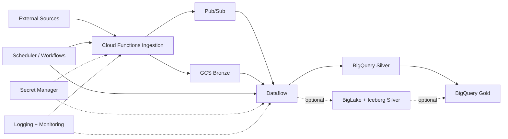

# 01 Context Overview

```mermaid
flowchart LR
    SRC["External Sources"] --> ING["Cloud Functions Ingestion"]
    ING --> PS["Pub/Sub"]
    ING --> BZ["GCS Bronze"]
    PS --> DF["Dataflow"]
    BZ --> DF
    DF --> SVBQ["BigQuery Silver"]
    SVBQ --> GOLDBQ["BigQuery Gold"]
    DF -. optional .-> SVBL["BigLake + Iceberg Silver"]
    SVBL -. optional .-> GOLDBQ

    ORCH["Scheduler / Workflows"] --> ING
    ORCH --> DF

    SEC["Secret Manager"] -.-> ING
    SEC -.-> DF
    OBS["Logging + Monitoring"] -.-> ING
    OBS -.-> DF
```
