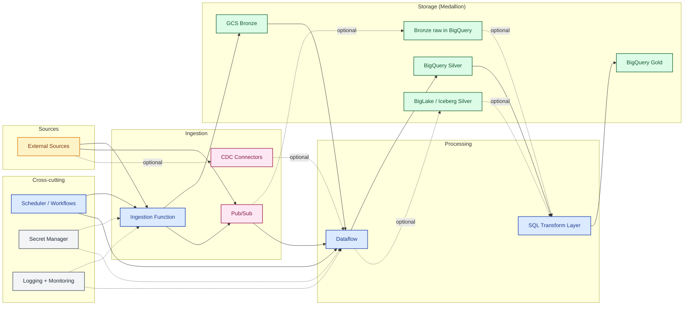

# 01 Context Overview

> **Scope.** End-to-end target topology of the hybrid platform —
> sources, ingestion paths, processing, and Medallion storage. Target
> topology, not implementation blueprint. CDC, BigLake/Iceberg, and
> direct Pub/Sub→BigQuery are shown as dashed (opt-in) paths; pick
> per source/SLA per the
> [decision matrix](../architecture.md#decision-matrix). For the
> control overlay (validation, DLQ, DQ gates) see
> [`02`](02-e2e-controls.md). Symbols:
> [conventions](README.md#diagram-conventions). Trade-offs:
> [`architecture.md`](../architecture.md).

| Symbol | Meaning |
| :--- | :--- |
| Solid arrow `-->` | Required path |
| Dashed arrow `-.->` | Cross-cutting touch point (observability, secrets) |
| Dashed labeled `-. text .->` | Optional path or out-of-band trigger |
| External | Source, sink, or third-party system |
| Compute | Function, Dataflow, transform, gate, orchestrator |
| Storage | GCS / BigQuery / Iceberg layer |
| Messaging | Broker or event channel |
| Cross-cutting | Error, observability, secrets — not on the happy path |
