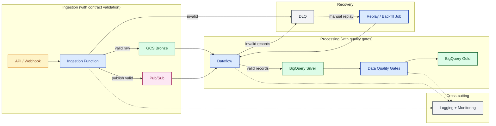

# 02 End-to-End Flow With Controls

> **Scope.** Same path as [`01`](01-context-overview.md), with the
> cross-cutting controls made explicit: contract validation at the
> source boundary, DLQ + replay, data-quality gates between layers,
> and observability touch points. Target topology, not implementation
> blueprint. Optional paths (CDC, BigLake/Iceberg, direct
> Pub/Sub→BigQuery) are intentionally omitted to keep the focus on
> controls — see [`01`](01-context-overview.md) for full topology.
> Symbols: [conventions](README.md#diagram-conventions). Trade-offs:
> [`architecture.md`](../architecture.md).

| Symbol | Meaning |
| :--- | :--- |
| Solid arrow `-->` | Required path |
| Dashed arrow `-.->` | Cross-cutting touch point (observability, secrets) |
| Dashed labeled `-. text .->` | Optional path or out-of-band trigger |
| External | Source, sink, or third-party system |
| Compute | Function, Dataflow, transform, gate, orchestrator |
| Storage | GCS / BigQuery / Iceberg layer |
| Messaging | Broker or event channel |
| Cross-cutting | Error, observability, secrets — not on the happy path |
