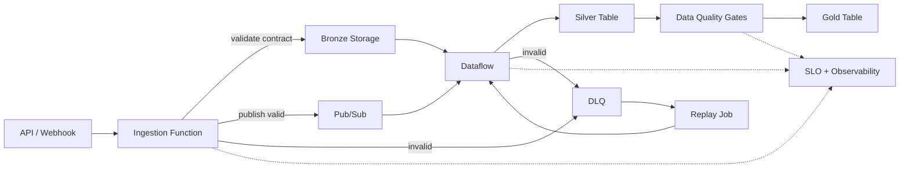

# 02 End-to-End Flow With Controls

```mermaid
flowchart LR
    API["API / Webhook"] --> FN["Ingestion Function"]
    FN -->|validate contract| BZ["Bronze Storage"]
    FN -->|publish valid| PS["Pub/Sub"]
    FN -->|invalid| DLQ["DLQ"]

    PS --> DF["Dataflow"]
    BZ --> DF
    DLQ --> RPL["Replay Job"]
    RPL --> DF

    DF --> SV["Silver Table"]
    DF -->|invalid| DLQ
    SV --> DQ["Data Quality Gates"]
    DQ --> GLD["Gold Table"]

    FN -.-> OBS["SLO + Observability"]
    DF -.-> OBS
    DQ -.-> OBS
```
