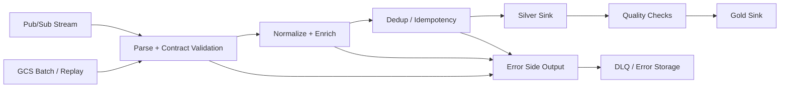

# 03 Dataflow Shared View

Use when streaming and batch/replay share most transforms.

```mermaid
flowchart LR
    IN1["Pub/Sub Stream"] --> PARSE["Parse + Contract Validation"]
    IN2["GCS Batch / Replay"] --> PARSE

    PARSE --> CLEAN["Normalize + Enrich"]
    CLEAN --> DEDUP["Dedup / Idempotency"]
    DEDUP --> SV["Silver Sink"]
    SV --> DQ["Quality Checks"]
    DQ --> GLD["Gold Sink"]

    PARSE --> ERR["Error Side Output"]
    CLEAN --> ERR
    DEDUP --> ERR
    ERR --> DLQ["DLQ / Error Storage"]
```
