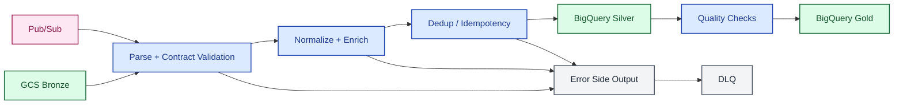

# 03 Dataflow Shared View

> **Scope.** Single Dataflow path used when streaming and batch/replay
> share most transforms. Target topology, not implementation blueprint.
> For mode-specific paths see [`03a`](03a-dataflow-streaming.md)
> (streaming) and [`03b`](03b-dataflow-batch-replay.md) (batch/replay).
> Symbols: [conventions](README.md#diagram-conventions). Trade-offs:
> [`architecture.md`](../architecture.md).

| Symbol | Meaning |
| :--- | :--- |
| Solid arrow `-->` | Required path |
| Dashed arrow `-.->` | Cross-cutting touch point (observability, secrets) |
| Dashed labeled `-. text .->` | Optional path or out-of-band trigger |
| External | Source, sink, or third-party system |
| Compute | Function, Dataflow, transform, gate, orchestrator |
| Storage | GCS / BigQuery / Iceberg layer |
| Messaging | Broker or event channel |
| Cross-cutting | Error, observability, secrets — not on the happy path |
