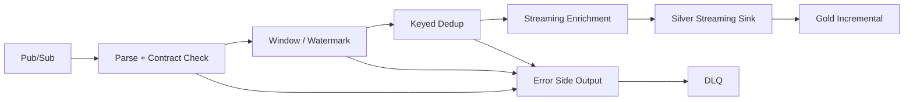

# 03A Dataflow Streaming View

Use when stream logic has specific windows/watermarks/latency constraints.

```mermaid
flowchart LR
    PS["Pub/Sub"] --> PARSE["Parse + Contract Check"]
    PARSE --> WM["Window / Watermark"]
    WM --> DEDUP["Keyed Dedup"]
    DEDUP --> ENRICH["Streaming Enrichment"]
    ENRICH --> SV["Silver Streaming Sink"]
    SV --> GLD["Gold Incremental"]

    PARSE --> ERR["Error Side Output"]
    WM --> ERR
    DEDUP --> ERR
    ERR --> DLQ["DLQ"]
```
