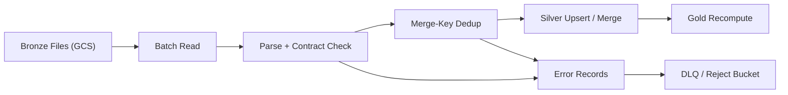

# 03B Dataflow Batch/Replay View

Use when backfill/replay path differs from stream path.

```mermaid
flowchart LR
    BZ["Bronze Files (GCS)"] --> READ["Batch Read"]
    READ --> PARSE["Parse + Contract Check"]
    PARSE --> DEDUP["Merge-Key Dedup"]
    DEDUP --> UPSERT["Silver Upsert / Merge"]
    UPSERT --> GLD["Gold Recompute"]

    PARSE --> ERR["Error Records"]
    DEDUP --> ERR
    ERR --> DLQ["DLQ / Reject Bucket"]
```
