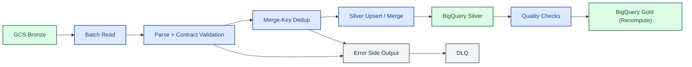

# 03B Dataflow Batch/Replay View

> **Scope.** Batch and replay/backfill Dataflow path when it diverges
> from the stream path (different read pattern, merge-key dedup,
> upsert/merge to Silver). Target topology, not implementation
> blueprint. Pair with [`03a`](03a-dataflow-streaming.md) for the
> streaming path. Symbols:
> [conventions](README.md#diagram-conventions). Trade-offs:
> [`architecture.md`](../architecture.md).

| Symbol | Meaning |
| :--- | :--- |
| Solid arrow `-->` | Required path |
| Dashed arrow `-.->` | Cross-cutting touch point (observability, secrets) |
| Dashed labeled `-. text .->` | Optional path or out-of-band trigger |
| External | Source, sink, or third-party system |
| Compute | Function, Dataflow, transform, gate, orchestrator |
| Storage | GCS / BigQuery / Iceberg layer |
| Messaging | Broker or event channel |
| Cross-cutting | Error, observability, secrets — not on the happy path |
