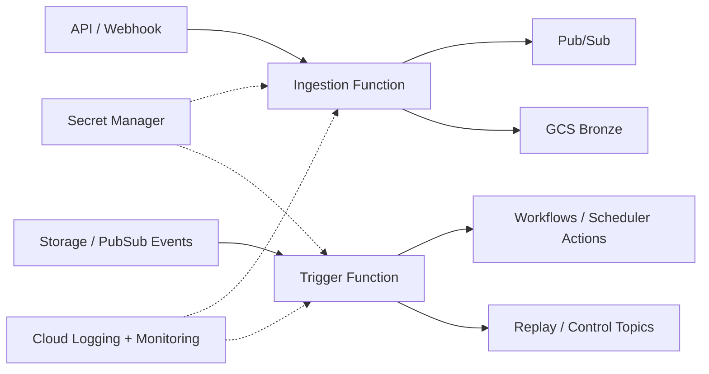

# 04 Cloud Functions Shared View

Use when ingestion and trigger handlers are simple and tightly related.

```mermaid
flowchart LR
    API["API / Webhook"] --> ING["Ingestion Function"]
    ING --> PS["Pub/Sub"]
    ING --> BZ["GCS Bronze"]

    EVT["Storage / PubSub Events"] --> TRG["Trigger Function"]
    TRG --> ORCH["Workflows / Scheduler Actions"]
    TRG --> CTRL["Replay / Control Topics"]

    SEC["Secret Manager"] -.-> ING
    SEC -.-> TRG
    OBS["Cloud Logging + Monitoring"] -.-> ING
    OBS -.-> TRG
```
