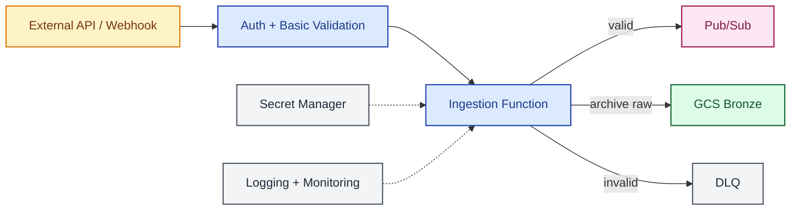

# 04A Cloud Functions Ingestion HTTP/Webhook

> **Scope.** Ingestion handler as an independent runtime unit (its
> own deploy/ownership). Target topology, not implementation
> blueprint. Pair with
> [`04b`](04b-functions-trigger-orchestration.md) when triggers are
> also independent. Symbols:
> [conventions](README.md#diagram-conventions). Trade-offs:
> [`architecture.md`](../architecture.md).

| Symbol | Meaning |
| :--- | :--- |
| Solid arrow `-->` | Required path |
| Dashed arrow `-.->` | Cross-cutting touch point (observability, secrets) |
| Dashed labeled `-. text .->` | Optional path or out-of-band trigger |
| External | Source, sink, or third-party system |
| Compute | Function, Dataflow, transform, gate, orchestrator |
| Storage | GCS / BigQuery / Iceberg layer |
| Messaging | Broker or event channel |
| Cross-cutting | Error, observability, secrets — not on the happy path |
