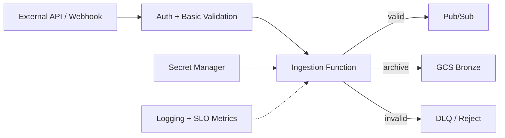

# 04A Cloud Functions Ingestion HTTP/Webhook

Use when ingestion should be documented as an independent runtime unit.

```mermaid
flowchart LR
    SRC["External API / Webhook"] --> AUTH["Auth + Basic Validation"]
    AUTH --> ING["Ingestion Function"]
    ING -->|valid| PS["Pub/Sub"]
    ING -->|archive| BZ["GCS Bronze"]
    ING -->|invalid| DLQ["DLQ / Reject"]

    SEC["Secret Manager"] -.-> ING
    OBS["Logging + SLO Metrics"] -.-> ING
```
