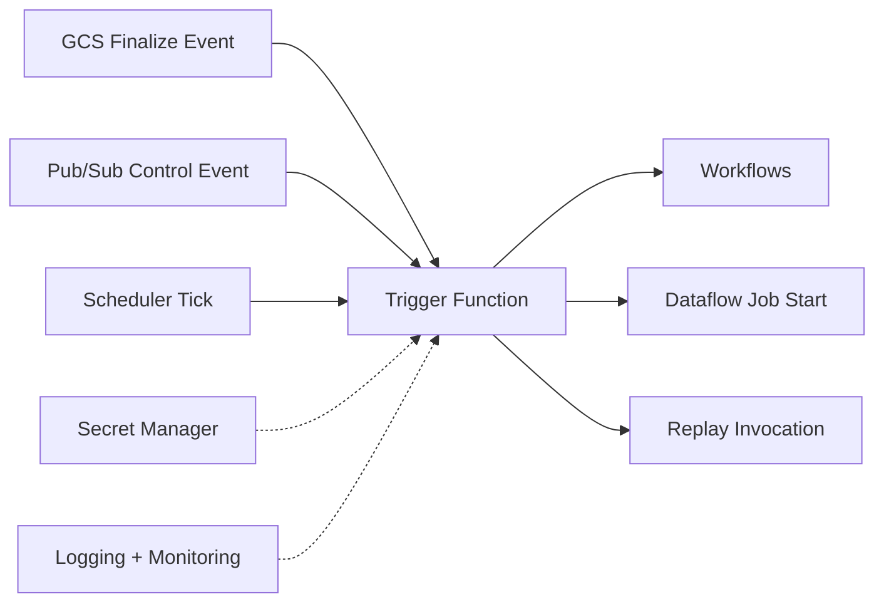

# 04B Cloud Functions Trigger/Orchestration

Use when trigger/orchestration handlers are independent deploy units.

```mermaid
flowchart LR
    EV1["GCS Finalize Event"] --> TRG["Trigger Function"]
    EV2["Pub/Sub Control Event"] --> TRG
    EV3["Scheduler Tick"] --> TRG

    TRG --> WF["Workflows"]
    TRG --> DFSTART["Dataflow Job Start"]
    TRG --> RPL["Replay Invocation"]

    SEC["Secret Manager"] -.-> TRG
    OBS["Logging + Monitoring"] -.-> TRG
```
