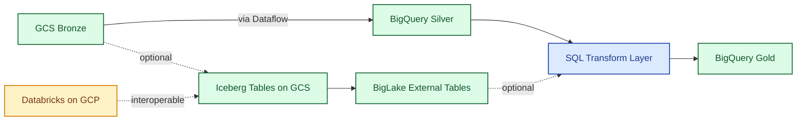

# 05 Storage Model Hybrid (BigQuery + Lakehouse)

> **Scope.** Storage layout for the hybrid platform — BigQuery native
> as default delivery target, BigLake/Iceberg as opt-in for
> interoperability and file-based workloads. Edges represent logical
> data flow between layers; processing (Dataflow / SQL) is shown as
> labels rather than nodes to keep the focus on storage. For the
> processing detail see [`03`](03-dataflow-shared.md). Symbols:
> [conventions](README.md#diagram-conventions). Trade-offs:
> [`architecture.md`](../architecture.md).

| Symbol | Meaning |
| :--- | :--- |
| Solid arrow `-->` | Required path |
| Dashed arrow `-.->` | Cross-cutting touch point (observability, secrets) |
| Dashed labeled `-. text .->` | Optional path or out-of-band trigger |
| External | Source, sink, or third-party system |
| Compute | Function, Dataflow, transform, gate, orchestrator |
| Storage | GCS / BigQuery / Iceberg layer |
| Messaging | Broker or event channel |
| Cross-cutting | Error, observability, secrets — not on the happy path |
