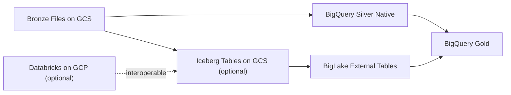

# 05 Storage Model Hybrid (BigQuery + Lakehouse)

```mermaid
flowchart LR
    BRZ["Bronze Files on GCS"] --> BQSIL["BigQuery Silver Native"]
    BRZ --> ICE["Iceberg Tables on GCS (optional)"]

    BQSIL --> BQGLD["BigQuery Gold"]
    ICE --> BL["BigLake External Tables"]
    BL --> BQGLD

    DBX["Databricks on GCP (optional)"] -. interoperable .-> ICE
```
